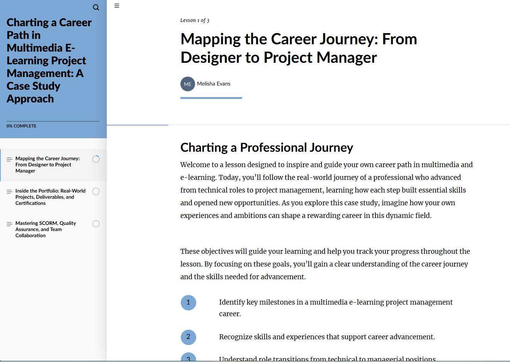

# Portfolio Course

https://greentree31.github.io/portfolio-mockup/

## Description

The motivation for this project was to provide a portfolio for employment opportunities.
This will help potential employers see what my past work and past projects were.
I created this site in Aritculate Rise 360 as a sample of my background and resume.

## Project Scope

- Portfolio-style presentation of professional experience
- Interactive, responsive course layout
- LMS-ready SCORM packaging
- Multimedia-rich content showcasing design and development skills

## Tech Stack & Tools Used

- **Frontend:** HTML5, CSS3, JavaScript  
- **E-Learning Authoring:** Articulate Rise 360  
- **Standards:** SCORM (course packaging and LMS communication)  
- **Design Tools:** Adobe Creative Suite  
- **UX/UI:** Responsive layouts, accessibility considerations  
- **Testing & QA:** LMS testing, content validation, user experience review  
- **Version Control:** Git, GitHub